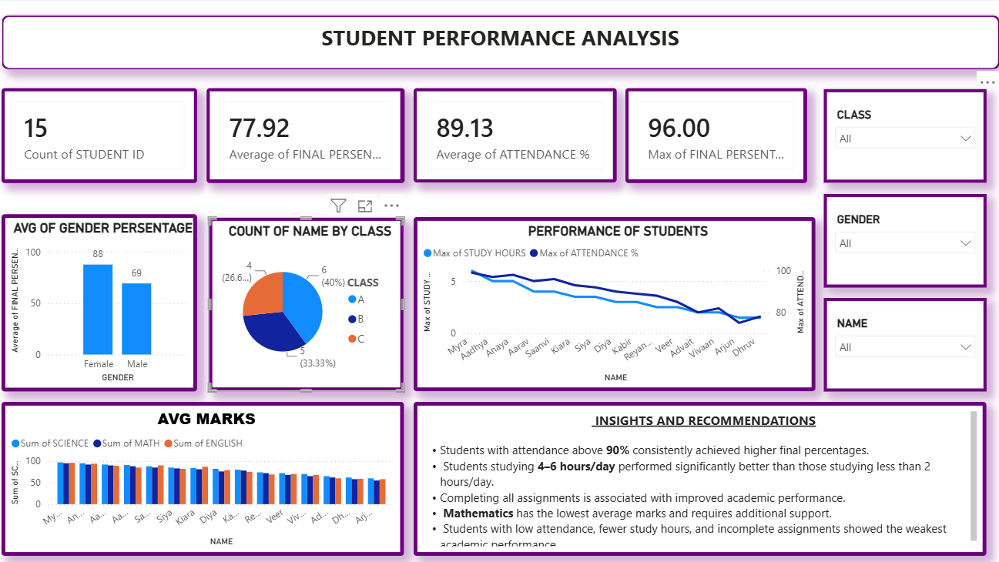

# 📊 Student Performance Analysis Dashboard

### Data Analyst Internship Assignment – Syntecxhub

An interactive **Student Performance Analysis Dashboard** built using **Power BI** to analyze student performance based on marks, attendance, study hours, assignment completion, and class-wise comparison. This project demonstrates data cleaning, KPI creation, DAX measures, and interactive data visualization.

---

## 📌 Project Overview

The objective of this project is to transform raw student data into meaningful academic insights through an interactive Power BI dashboard.

The dashboard enables users to:
- Analyze overall student performance.
- Compare subject-wise performance.
- Identify factors affecting academic results (attendance and study hours).
- Compare performance across different classes and genders.
- Monitor key academic KPIs.
- Interact with the dashboard using filters and slicers.

---

## 🛠️ Tools & Technologies

| Tool | Purpose |
|------|---------|
| Power BI Desktop | Dashboard Development |
| Power Query | Data Cleaning & Transformation |
| DAX | KPI Measures & Calculations |

---

## 📂 Dataset

**Dataset:** Student Performance Dataset

**File Format:** Excel (.xlsx)

**Total Students:** 15

### Key Columns
- Student ID
- Student Name
- Class
- Gender
- Mathematics Marks
- Science Marks
- English Marks
- Attendance (%)
- Study Hours/Day
- Assignments Completed
- Final Percentage

---

## 📊 Dashboard Features

- ✅ Total Students KPI
- ✅ Average Final Percentage KPI
- ✅ Average Attendance KPI
- ✅ Highest Final Percentage KPI
- ✅ Subject-wise Performance Analysis
- ✅ Class-wise Performance Comparison
- ✅ Gender-wise Performance Comparison
- ✅ Attendance vs Academic Performance
- ✅ Study Hours vs Academic Performance
- ✅ Top Performing Students
- ✅ Interactive Class Filter
- ✅ Interactive Gender Filter
- ✅ Interactive Student Filter
- ✅ Academic Insights & Recommendations

---

## 📈 KPIs Created

- Total Students
- Average Final Percentage
- Average Attendance
- Highest Final Percentage

---

## 📸 Dashboard Preview



---

## 💡 Key Insights

- Students with attendance above **90%** achieved higher academic performance.
- Students studying **4–6 hours per day** scored significantly better than those studying less than **2 hours/day**.
- Mathematics recorded the lowest average marks among the three subjects.
- Class A achieved the highest overall academic performance.
- Students completing all assignments consistently scored higher final percentages.
- Low attendance and fewer study hours were associated with lower academic performance.

---

## 📁 Repository Structure

```text
Student_Performance_Analysis/
│
├── Student_Performance_Dashboard.pbix
├── Student_Performance_Dataset.xlsx
├── Dashboard_Screenshot.png
└── README.md
```

---

## 👨‍💻 Author

**Shlok Mayekar**

B.E. – Artificial Intelligence and Data Science Engineering

Mumbai University

**GitHub:** https://github.com/shlok1624

**LinkedIn:** www.linkedin.com/in/shlok-mayekar-828526383

---

## ⭐ Internship Task Completed

✔️ Imported and cleaned the student dataset using Power Query.

✔️ Analyzed subject-wise and overall student performance.

✔️ Identified factors affecting academic performance using attendance and study hours.

✔️ Compared performance across different classes and genders.

✔️ Created KPIs including Total Students, Average Final Percentage, Average Attendance, and Highest Final Percentage.

✔️ Built an interactive Power BI dashboard using slicers, charts, KPIs, and academic insights.

---

This project was developed as part of the **Syntecxhub Data Analyst Internship**.
